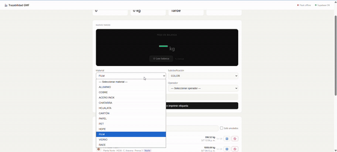
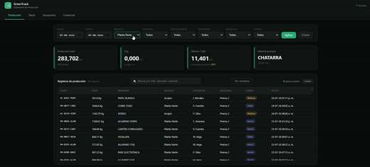
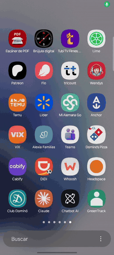

# GreenTrack

**Sistema de trazabilidad y control de producción para plantas de reciclaje.**

Conecta la balanza y la impresora que la planta ya tiene, y convierte cada pesaje en un registro trazable: qué material entró, quién lo procesó, en qué máquina y turno, dónde está y hacia dónde salió.

Está en producción en una planta de reciclaje de metales desde 2025.

---

## Demo

**Aplicaciones en vivo:**

- 🖥️ **Pesaje** — [abrir app](https://green-track-demo-gmf-cons-s-projects.vercel.app/pesaje/)
- 📊 **Dashboard** — [abrir app](https://green-track-demo-gmf-cons-s-projects.vercel.app/dashboard/)
- 📱 **App de despacho (Android)** — [descargar APK](https://github.com/gmolinaf/GreenTrack-Demo/releases/latest)

Las webapps corren sobre una base de demostración con datos ficticios. La lectura de balanza y la impresión requieren el bridge local con hardware conectado; sin él, el pesaje permite ingreso manual.

### Pesaje

Interfaz de operación de planta. Lee el peso desde la balanza por puerto serial, clasifica el material contra un catálogo dinámico e imprime la etiqueta con folio correlativo y código QR antes de registrar. Incluye ingreso manual de respaldo, historial de producción, programación de despachos, contingencia y administración de catálogos.



### Dashboard

Capa de visibilidad para administración. Muestra el stock disponible por material y bodega, la producción por operador, turno y máquina, y el historial de despachos — todo filtrable y actualizado en vivo. Cada número es rastreable hasta el pesaje que lo originó.



### App de despacho

App móvil para el patio. El operario escanea el código QR de cada etiqueta al cargar el camión; la app valida el material contra el catálogo sincronizado con la base y registra el despacho con su origen y destino. Funciona con la cámara del teléfono y permite ingreso manual del folio si la etiqueta está dañada.



---

## El problema

Una planta de reciclaje pesa material todo el día. La balanza está conectada al PC por un cable serial, la impresora de etiquetas está al lado — y el operario anota el peso en una planilla, que alguien después transcribe.

Eso genera tres problemas que se acumulan:

- **No hay trazabilidad.** Cuando un cliente reclama por un lote, no se puede reconstruir de dónde salió.
- **No hay visibilidad.** El dueño no sabe cuánto tiene en patio ni cuánto produjo cada turno sin armar el dato a mano.
- **El reporte normativo se arma a mano.** En Chile, toda instalación que recibe más de 12 toneladas anuales de residuos no peligrosos debe declarar mensualmente al RETC. Con planillas dispersas, ese consolidado se construye sumando a mano, con el riesgo de inconsistencias que la autoridad cruza contra los manifiestos de transporte.

El software empresarial que resuelve esto cuesta lo que una pyme no paga. GreenTrack apunta exactamente a esa brecha.

---

## Arquitectura

```
   Balanza (RS-232 / USB-Serial)          Impresora térmica (ZPL)
            │                                       ▲
            │                                       │
            └──────────► Bridge local (Flask) ──────┘
                                │  HTTP en localhost
                                ▼
                    Webapp de pesaje (navegador)
                                │
                                ▼
                    ┌───────────────────────┐
                    │  Supabase (Postgres)  │
                    │  · pesaje_data        │
                    │  · despachos          │
                    │  · materiales         │
                    └───────────────────────┘
                       ▲                  ▲
                       │                  │
          App Android (escaneo QR)   Dashboard (Chart.js)
             despacho en patio         visibilidad
```

Cuatro componentes, un solo flujo:

| Componente | Rol |
|---|---|
| **`bridge/`** | Servicio Python local. Traduce HTTP a hardware: lee el puerto serial de la balanza y envía ZPL crudo a la impresora. Existe porque el navegador no puede hablar con un puerto COM. |
| **`pesaje/`** | Interfaz de operación. Además del pesaje (captura, clasificación, impresión y registro), incluye programación de despachos, despacho de contingencia por folio, corrección de fardos con traza de auditoría, y administración de catálogos (materiales, operadores, máquinas). |
| **`android/`** | App de despacho. El operario escanea el QR de cada etiqueta al cargar el camión; valida contra los materiales permitidos del despacho. |
| **`dashboard/`** | Capa de visibilidad. Stock por material, producción por operador y turno, historial de despachos. |

---

## Decisiones de diseño

Las tres decisiones que definen el sistema, y el problema real que cada una resuelve.

### Imprimir primero, registrar después

Si la etiqueta no sale de la impresora, el pesaje **no se guarda**.

Suena contraintuitivo — lo natural sería guardar y después imprimir. Pero un fardo registrado en el sistema sin etiqueta física es material imposible de identificar en el patio: aparece en el inventario y nadie sabe cuál es. Es peor que no tenerlo registrado, porque el error es silencioso.

Con este orden, una impresión fallida se traduce en que el operario vuelve a pesar. Molesto, pero recuperable.

### Folios correlativos sin huecos

La decisión anterior obliga a conocer el folio **antes** de guardar, para poder imprimirlo. Si el número se consumiera al imprimir, cada impresión fallida dejaría un hueco en la numeración — inaceptable para trazabilidad auditable, donde un salto en el correlativo es exactamente lo que una fiscalización pregunta.

Se resuelve en dos pasos:

- `peek_siguiente_folio()` — consulta cuál sería el próximo número **sin consumirlo**. Solo para componer la etiqueta.
- `registrar_fardo()` — reserva el número y hace el `INSERT` en la misma transacción, serializada con un lock advisory de Postgres.

La función devuelve el folio **definitivo**. Si dos estaciones registraron en el mismo instante y el número cambió, la interfaz avisa que hay que reimprimir: la etiqueta física siempre debe cuadrar con la base.

Ver [`sql/schema.sql`](sql/schema.sql).

### Catálogo híbrido: núcleo estable, variación en datos

El árbol de materiales vive en el código (estable, viaja con el despliegue) y en runtime se le **fusionan en memoria** los materiales agregados en la tabla `materiales`.

Convención: un material padre usa su código normal (`ALUM`); una subcategoría usa `PADRE|SUB` (`ALUM|PERFIL`).

Esto permite que cada planta amplíe su catálogo en operación sin redesplegar ni tocar código, mientras el núcleo permanece idéntico entre instalaciones. Es la costura que separa lo que es igual para todos de lo que cambia por cliente.

La misma fusión ocurre en las **tres interfaces** —pesaje, dashboard y app de despacho—, cada una contra la misma tabla. Un material nuevo registrado en el pesaje aparece automáticamente como opción válida en el despacho, sin recompilar la app móvil. El árbol en código es solo la base; la fuente de verdad del catálogo es la tabla.

En la base, material y subclasificación se guardan en **columnas separadas** — nunca concatenados. Agrupar por material padre en los reportes no requiere parsear strings. En la etiqueta impresa sí van juntos (`ALUM-PERFIL`), porque el operario lee un solo código.

---

## Diseñado para el peor día en la planta

Un sistema industrial no se juzga cuando todo funciona. Se juzga cuando se cortó el internet, entró un operario nuevo y hay un camión esperando.

- **La balanza no responde** → ingreso manual de peso. La planta no se detiene porque falló un componente.
- **La impresora falla** → el pesaje queda pendiente y es reintentable sin volver a cargar los datos ni pedir otro folio.
- **Errores de conexión física** → mensajes con la acción concreta ("revisa el cable USB, verifica que tenga etiquetas"), no códigos de error. La mayoría de las llamadas a soporte se evitan cuando el mensaje dice qué hacer.
- **Semáforo de estado permanente** → el operario ve si la balanza y la base están en línea antes de intentar la operación.
- **QR ilegible** → la app permite buscar por los dígitos del correlativo, que son legibles a simple vista en la etiqueta.

---

## Stack

- **Backend:** Supabase (PostgreSQL) — funciones RPC en PL/pgSQL, RLS, REST
- **Bridge:** Python 3, Flask, pyserial, pywin32
- **Web:** HTML/CSS/JS sin framework — la webapp corre en PCs de planta, algunos antiguos
- **Dashboard:** Chart.js
- **Móvil:** Android nativo (Java), CameraX + ML Kit para escaneo de QR
- **Impresión:** ZPL sobre spooler RAW

---

## Cómo correrlo

**1. Base de datos**

Crear un proyecto en [Supabase](https://supabase.com) y ejecutar en el SQL Editor:

```
sql/schema.sql    -- tablas, funciones de folio, políticas RLS
sql/seed.sql      -- datos de ejemplo
```

> Partiendo de cero, `schema.sql` crea todo. `sql/migracion_completar.sql` solo se usa para completar una base anterior que ya tuviera datos.

**2. Configuración**

```bash
cp .env.example .env
# completar SUPABASE_URL y SUPABASE_ANON_KEY
```

**3. Bridge local** (solo si hay hardware conectado)

```bash
cd bridge
pip install -r requirements.txt
python app.py
```

**4. Web y dashboard**

Local: servir la raíz del repo con cualquier servidor estático.

```bash
python -m http.server 3000
# → http://localhost:3000/pesaje/
# → http://localhost:3000/dashboard/
```

En Vercel: importar el repositorio con *Root Directory* en la raíz. Cada interfaz queda bajo `/pesaje/` y `/dashboard/`. Las credenciales se editan en las constantes al inicio del `<script>` de cada `index.html`.

**5. Android**

Definir las credenciales en `local.properties` (no versionado):

```properties
SUPABASE_URL=https://tu-proyecto.supabase.co
SUPABASE_ANON_KEY=tu-anon-key
```

Y exponerlas como `BuildConfig` en `app/build.gradle`:

```gradle
android {
    buildFeatures { buildConfig = true }

    defaultConfig {
        def props = new Properties()
        props.load(project.rootProject.file('local.properties').newDataInputStream())

        buildConfigField "String", "SUPABASE_URL",
            "\"${props.getProperty('SUPABASE_URL')}\""
        buildConfigField "String", "SUPABASE_ANON_KEY",
            "\"${props.getProperty('SUPABASE_ANON_KEY')}\""
    }
}
```

Compilar el APK:

```bash
./gradlew assembleDebug
# → app/build/outputs/apk/debug/app-debug.apk
```

---

## Sobre las credenciales

La `anon key` de Supabase viaja en el cliente **por diseño**: es un identificador público, no un secreto. Lo que protege los datos son las políticas RLS definidas en `sql/schema.sql`.

Este repositorio usa políticas abiertas para que el demo funcione al clonarlo. Una instalación real restringe por rol autenticado.

---

## Estado

En producción desde 2025. Este repositorio es una versión de demostración: misma arquitectura y mismas decisiones de diseño, con catálogo genérico y datos ficticios.

---

## Licencia

Este código se publica **únicamente como muestra de portafolio**. Puede verse y evaluarse, pero no usarse, copiarse ni incorporarse a otros sistemas sin autorización escrita del autor. Ver [`LICENSE`](LICENSE).
